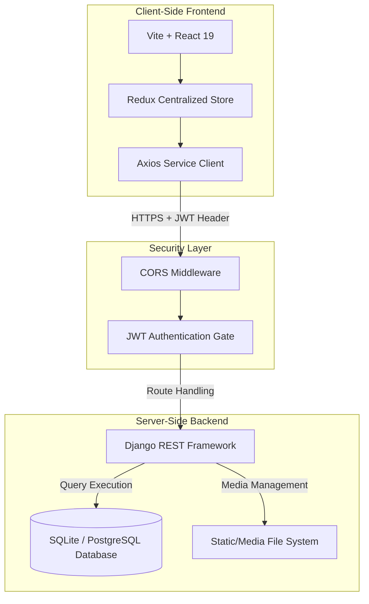
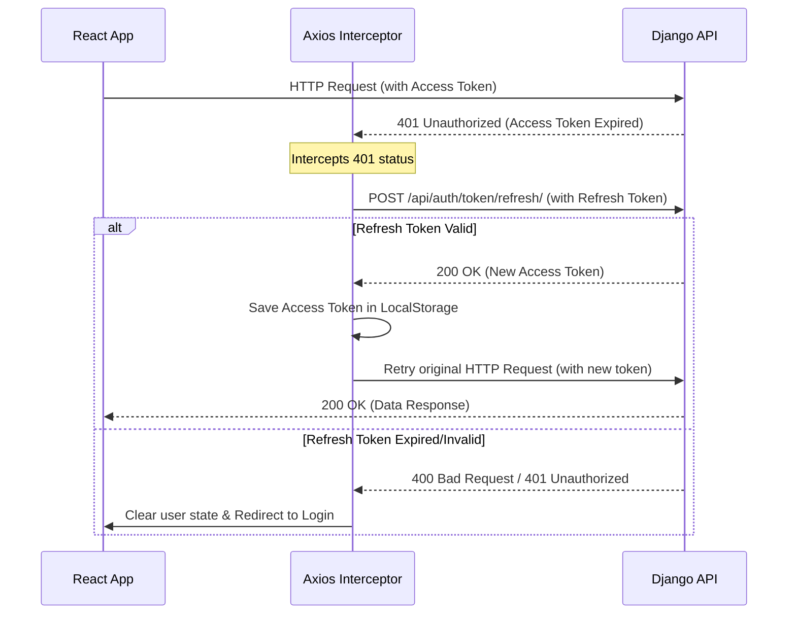

# 📘 System Architecture & API Specifications

This document outlines the detailed system architecture, database design, API routing, and security patterns implemented in the AI Job Board project.

---

## 🏗️ System Architecture & Data Flow

The platform uses a decoupled, single-origin architecture for development and deployment. The backend serves purely as a stateless RESTful JSON API, while the frontend handles state representation and DOM updates dynamically.



---

## 🗄️ Database Schema & Models

The backend utilizes Django's ORM mapping to represent tables. Below are the core entity schemas:

### 1. `User` (Custom Authentication Model)
Extends Django's `AbstractBaseUser` to handle unique email identity and profile media fields.

| Column Name | Data Type | Key Type | Description |
| :--- | :--- | :--- | :--- |
| `id` | BigAuto | Primary | Unique identifier |
| `email` | EmailField | Unique | Primary login identity |
| `full_name` | CharField(150) | - | User's display name |
| `avatar` | ImageField | - | Profile picture upload path |
| `resume` | FileField | - | PDF Resume document upload path |
| `github_link` | URLField | - | Link to GitHub profile |
| `is_active` | Boolean | - | Status flag for accounts |
| `is_staff` | Boolean | - | Access to Django Admin console |

### 2. `SavedJob`
Tracks the jobs bookmarked by candidates.

| Column Name | Data Type | Key Type | Description |
| :--- | :--- | :--- | :--- |
| `id` | BigAuto | Primary | Unique saved record identifier |
| `user` | ForeignKey | Many-to-One | Links to the bookmarked `User` |
| `job_id` | Integer | - | ID referencing the job role |
| `created_at` | DateTime | - | Timestamp when job was saved |

### 3. `JobApplication`
Logs candidate applications and manages recruitment status.

| Column Name | Data Type | Key Type | Description |
| :--- | :--- | :--- | :--- |
| `id` | BigAuto | Primary | Unique application record identifier |
| `user` | ForeignKey | Many-to-One | Links to the applying `User` |
| `job_id` | Integer | - | ID referencing the job role |
| `status` | CharField(20) | - | Status: `Applied`, `Interviewing`, `Accepted`, `Rejected` |
| `applied_date` | DateTime | - | Date/time of submission |

---

## 🔒 Security & Token Sliding Session Flow

Authentication is built around **JSON Web Tokens (JWT)**.
1. **Access Token:** Expires after **60 minutes**. Sent as an `Authorization: Bearer <token>` HTTP header.
2. **Refresh Token:** Expires after **7 days**. Used to automatically request a new access token once expired.

### Sliding Session Interceptor
Our frontend Axios client utilizes a response interceptor to handle token refresh cycles:



---

## 🔌 API Endpoints Reference

All requests and responses carry a Content-Type of `application/json` except for media file uploads, which use `multipart/form-data`.

### Authentication Endpoints

#### 1. Register User
* **URL:** `/api/auth/register/`
* **Method:** `POST`
* **Content-Type:** `multipart/form-data`
* **Request Payload:**
  * `full_name` (String, required)
  * `email` (String, required)
  * `password` (String, required)
  * `confirm_password` (String, required)
  * `avatar` (File - Image, optional)
  * `resume` (File - PDF, optional)
* **Response (201 Created):**
  ```json
  {
    "id": 1,
    "email": "candidate@example.com",
    "full_name": "John Doe",
    "avatar": "/media/avatars/johndoe.png",
    "resume": "/media/resumes/johndoe.pdf",
    "github_link": ""
  }
  ```

#### 2. Obtain Token (Login)
* **URL:** `/api/auth/login/`
* **Method:** `POST`
* **Request Payload:**
  ```json
  {
    "email": "candidate@example.com",
    "password": "Password123"
  }
  ```
* **Response (200 OK):**
  ```json
  {
    "access": "eyJhbGciOiJIUzI1NiIsInR5cCI6IkpXVCJ9...",
    "refresh": "eyJhbGciOiJIUzI1NiIsInR5cCI6IkpXVCJ9...",
    "user": {
      "id": 1,
      "full_name": "John Doe",
      "email": "candidate@example.com",
      "avatar": "https://ai-job-board-backend-zmpj.onrender.com/media/avatars/johndoe.png",
      "resume": "https://ai-job-board-backend-zmpj.onrender.com/media/resumes/johndoe.pdf",
      "github_link": ""
    }
  }
  ```

#### 3. Refresh Access Token
* **URL:** `/api/auth/token/refresh/`
* **Method:** `POST`
* **Request Payload:**
  ```json
  {
    "refresh": "eyJhbGciOiJIUzI1NiIsInR5cCI6IkpXVCJ9..."
  }
  ```
* **Response (200 OK):**
  ```json
  {
    "access": "eyJhbGciOiJIUzI1NiIsInR5cCI6IkpXVCJ9..."
  }
  ```

#### 4. Retrieve / Update Profile
* **URL:** `/api/auth/me/`
* **Method:** `GET` (Retrieve) / `PUT` (Update)
* **Headers:** `Authorization: Bearer <access_token>`
* **Request Payload (for PUT - `multipart/form-data`):**
  * `full_name` (optional)
  * `email` (optional)
  * `avatar` (File, optional)
  * `resume` (File, optional)
  * `github_link` (optional)
* **Response (200 OK):**
  ```json
  {
    "id": 1,
    "email": "candidate@example.com",
    "full_name": "John Doe",
    "avatar": "https://ai-job-board-backend-zmpj.onrender.com/media/avatars/johndoe.png",
    "resume": "https://ai-job-board-backend-zmpj.onrender.com/media/resumes/johndoe.pdf",
    "github_link": "https://github.com/johndoe"
  }
  ```

---

### Dashboard Operations Endpoints (Authenticated)

#### 5. Fetch Bookmarked Jobs
* **URL:** `/api/auth/saved-jobs/`
* **Method:** `GET`
* **Headers:** `Authorization: Bearer <access_token>`
* **Response (200 OK):**
  ```json
  [
    {
      "id": 12,
      "job_id": 101,
      "created_at": "2026-07-10T14:32:10Z"
    }
  ]
  ```

#### 6. Toggle Saved Job
* **URL:** `/api/auth/saved-jobs/`
* **Method:** `POST`
* **Headers:** `Authorization: Bearer <access_token>`
* **Request Payload:**
  ```json
  {
    "job_id": 101
  }
  ```
* **Response (200 OK / 201 Created):**
  ```json
  {
    "message": "Saved job toggled successfully."
  }
  ```

#### 7. Fetch Submitted Applications
* **URL:** `/api/auth/applications/`
* **Method:** `GET`
* **Headers:** `Authorization: Bearer <access_token>`
* **Response (200 OK):**
  ```json
  [
    {
      "id": 4,
      "job_id": 101,
      "status": "Applied",
      "applied_date": "2026-07-10T14:35:45Z"
    }
  ]
  ```

#### 8. Submit Job Application
* **URL:** `/api/auth/applications/`
* **Method:** `POST`
* **Headers:** `Authorization: Bearer <access_token>`
* **Request Payload:**
  ```json
  {
    "job_id": 101
  }
  ```
* **Response (201 Created):**
  ```json
  {
    "id": 4,
    "job_id": 101,
    "status": "Applied",
    "applied_date": "2026-07-10T14:35:45Z"
  }
  ```
